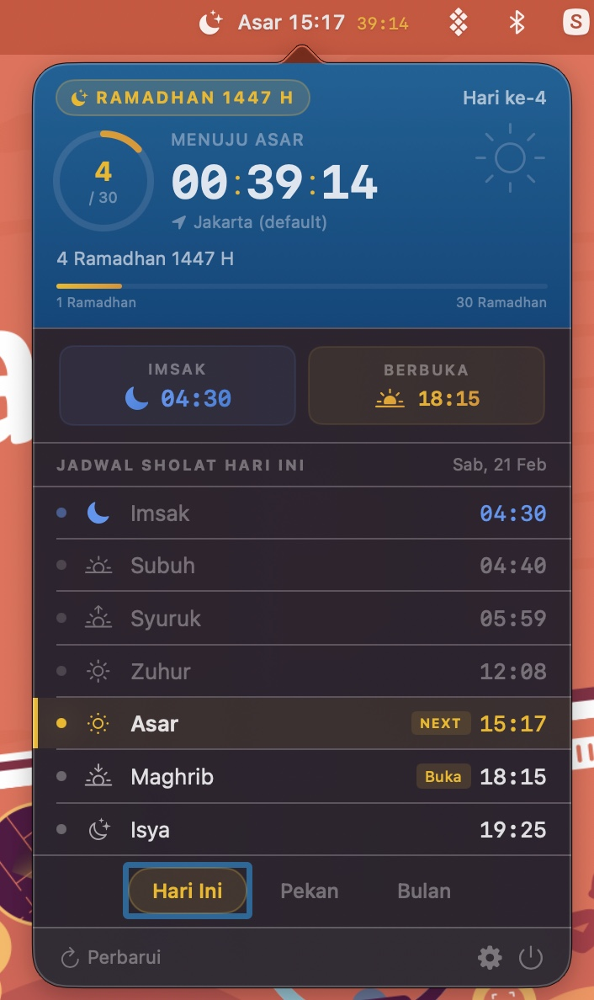
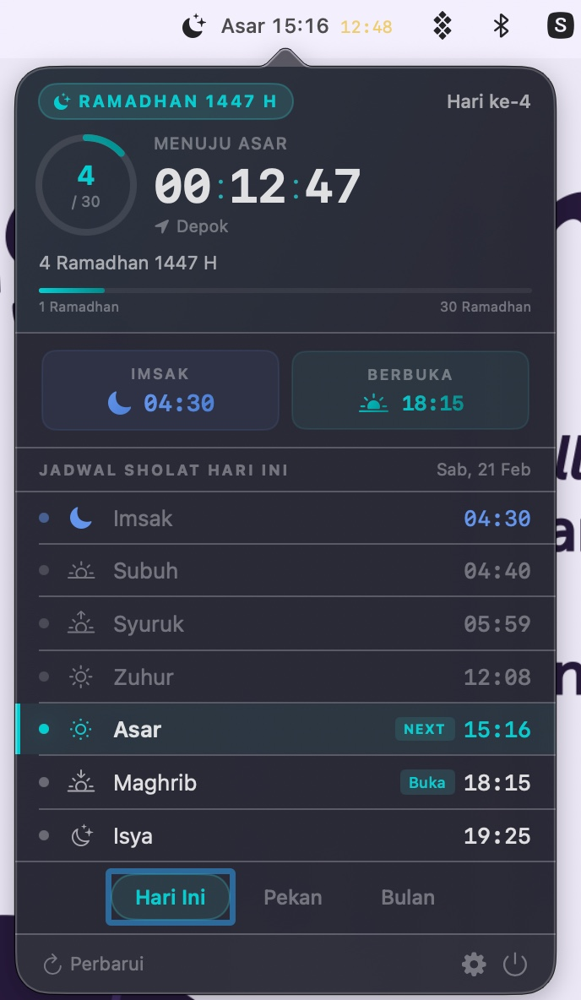
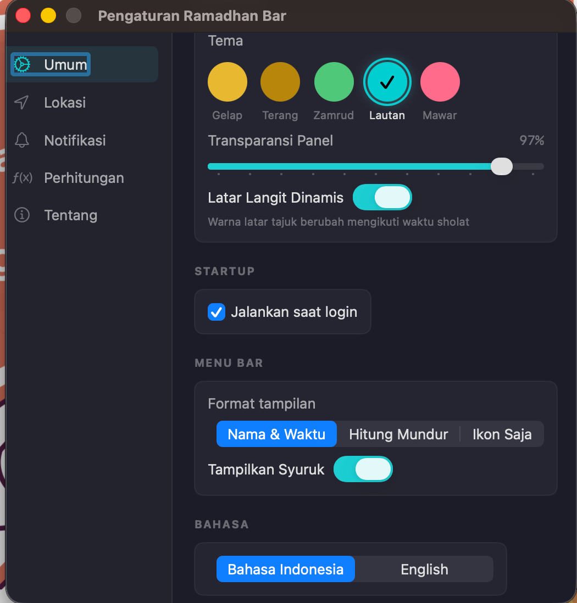
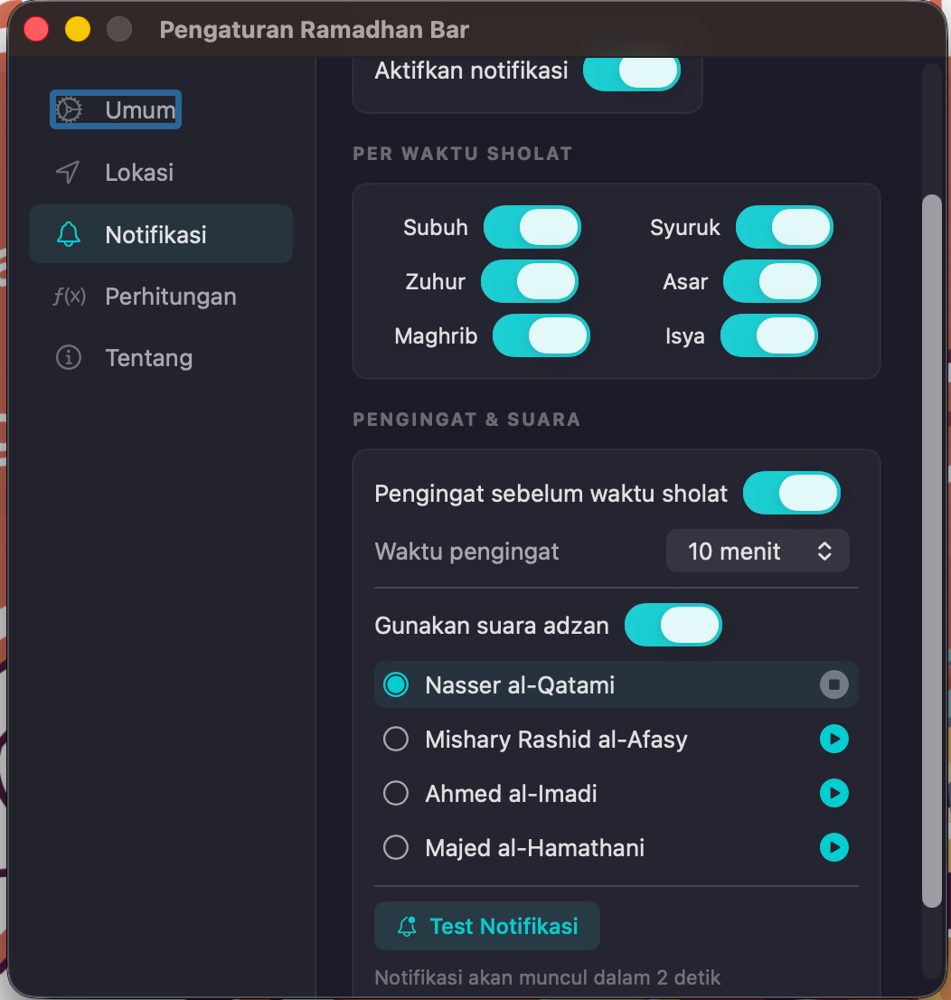

# Ramadhan Bar

Aplikasi menu bar macOS untuk menampilkan waktu sholat dan jadwal puasa Ramadhan (imsak & iftar).

  

## Screenshot

  
  &nbsp;&nbsp;
  

  
  &nbsp;&nbsp;
  

## Fitur

- Waktu sholat 6 waktu (Subuh, Syuruk, Zuhur, Asar, Maghrib, Isya)
- Countdown timer ke waktu sholat berikutnya
- Jadwal imsak & iftar saat Ramadhan
- Tracking hari Ramadhan dengan kalender Hijriyah
- Notifikasi waktu sholat dengan pilihan suara adzan
- Perhitungan offline menggunakan metode Kemenag RI
- Tema gelap/terang
- Auto-update

## Persyaratan

- macOS 14.0 (Sonoma) atau lebih baru
- Apple Silicon / Intel (Universal)

## Cara Install

1. Download file **RamadhanBar-x.x.x.dmg** dari halaman [Releases](https://github.com/daffigusti/RamadhanBar-releases/releases/latest)
2. Buka file DMG yang sudah didownload
3. Drag **Ramadhan Bar.app** ke folder **Applications**
4. Buka **Ramadhan Bar** dari folder Applications atau Launchpad
5. Jika muncul peringatan keamanan macOS:
   - Buka **System Settings** → **Privacy & Security**
   - Scroll ke bawah, klik **Open Anyway** di samping pesan tentang Ramadhan Bar
6. Icon bulan sabit akan muncul di menu bar — klik untuk membuka panel waktu sholat

## Update

Aplikasi akan otomatis mengecek pembaruan secara berkala. Kamu juga bisa cek manual melalui:

**Pengaturan** → **Tentang** → **Periksa Pembaruan**

## Uninstall

1. Tutup Ramadhan Bar (klik kanan icon di menu bar → **Keluar**)
2. Hapus **Ramadhan Bar.app** dari folder Applications
